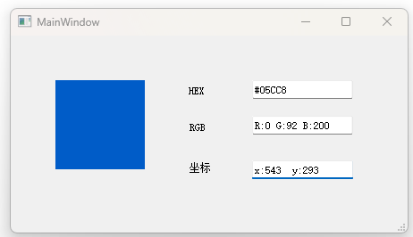
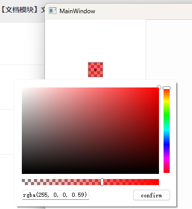

#### 自定义控件

* 自定义控件命名空间：`Custom_Control`。

#### 自定义控件列表

- [x] `ColorSpy`： 桌面颜色拾取器。

  

- [x] `RadioButton`：单选按钮

  

- [x] `ColorPicker`：颜色选择器。

  

  

  * `ColorHueBar`：
  * `ColorSVCanvas`：
  * `ColorChecker`：
  * `ColorAlphaBar`：
  * `ColorWorkbench`：
  * `ColorPicker`：

